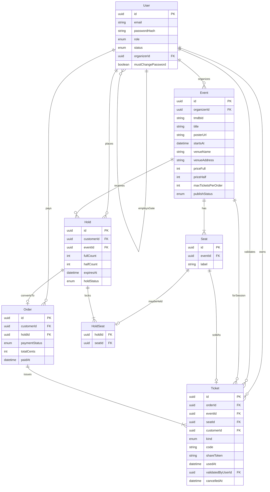

# Software Design Document (SDD) — PHCTickets

**Projeto:** PHCTickets (sessões de cinema e ingressos)  
**Versão:** 1.2.0  
**Status:** Pronto para implementação do Must  
**Stack:** NestJS (Express), React, Vite, Mantine, Prisma, PostgreSQL, TMDb  
**Produto:** [PRD](PRD.md) · **Visual:** [visual.md](visual.md)

---

## 1. Arquitetura do Sistema (Monorepo)

Dois processos no mesmo repositório:

- **`apps/api`:** Backend NestJS (`@nestjs/platform-express`).
- **`apps/web`:** SPA React + Vite + Mantine.

A tela desenha mapa, formulários e câmera. A API decide assento livre, pagamento, QR e papéis.

> **Instrução para a IA:** Regras de negócio ficam na API. A UI pode esconder botões; o servidor recusa o mesmo pedido mesmo assim.

## 2. Contexto para a IA (Skills)

> **Instrução para a IA:** Antes de scaffold, rota ou teste, leia as skills em `.agents/skills/` e este SDD.

| Skill | Use |
| ----- | --- |
| `docs-voice` | Docs and issue wording |
| `prd-moscow` | Must / Should / Could / Won’t scope |
| `sdd-constraints` | Folders, stack, JWT, Prisma (overrides TypeORM tips) |
| `mantine-ui` | Screens and theme (Roboto, palette) |
| `reservation-integrity` | Hold, uniqueness, QR, gate |
| `tdd-api` | Jest tests before implementation |
| `nestjs-expert` | Nest patterns (DI, guards, pipes); ORM = Prisma via `prisma-expert` |
| `prisma-expert` | Schema, migrations, queries |

Skills are English. Product docs (PRD, SDD, visual) stay Portuguese for the evaluator.

Sem MCP obrigatório neste projeto. Migrações via Prisma CLI; diagrama da seção 4 é a fonte da verdade do schema.

## 3. Stack Tecnológica

> Nenhuma dependência fora desta lista entra no Must sem atualizar esta seção.

### Core

- **Runtime:** Node.js 20.x LTS  
- **Banco:** PostgreSQL  
- **ORM:** Prisma  
- **API:** NestJS + Express  
- **Web:** React + TypeScript + Vite + Mantine  
- **Testes API:** Jest + Supertest (padrão Nest). Sem Vitest/Mocha no backend.  
- **Catálogo:** TMDb (chave só no ambiente da API)

### Bibliotecas permitidas (Must)

- **Auth:** `@nestjs/jwt`, `@nestjs/passport`, Passport JWT, `bcryptjs`  
- **Validação:** `class-validator`, `class-transformer` + ValidationPipe global (`whitelist: true`)  
- **Config:** `@nestjs/config`  
- **Docs API:** `@nestjs/swagger` (`/api/docs`)  
- **QR (web ou api):** lib de geração de QR a partir do `code`  
- **Fonte web:** `@fontsource/roboto` (ou equivalente)  
- **Formulários web:** `@mantine/form`, `@mantine/notifications`
- **Textos (i18n):** `nestjs-i18n` (API), `i18next` + `react-i18next` (web). Locale único `pt`; centraliza labels, validação e mensagens de erro reutilizáveis.

### Fora do Must

Ticketmaster, pista, websocket do mapa, entidade estabelecimento, Next.js, Fastify, CQRS, Redis, refresh token, API serverless, E2E de browser.

## 4. Arquitetura de Dados

### 4.1. Glossário técnico

| Termo PRD | Entidade | Atributos principais |
| --------- | -------- | -------------------- |
| Usuário | `User` | `id, email, passwordHash, role, status, organizerId, mustChangePassword` |
| Sessão | `Event` | `id, organizerId, tmdbId, title, posterUrl, startsAt, venueName, venueAddress, priceFull, priceHalf, maxTicketsPerOrder, publishStatus` |
| Assento | `Seat` | `id, eventId, label` |
| Retenção | `Hold` | `id, customerId, eventId, fullCount, halfCount, expiresAt, holdStatus` |
| Assento retido | `HoldSeat` | `holdId, seatId` |
| Pedido | `Order` | `id, customerId, holdId, paymentStatus, totalCents, paidAt` |
| Ingresso | `Ticket` | `id, orderId, eventId, seatId, customerId, kind, code, shareToken, usedAt, validatedByUserId, cancelledAt` |

`role`: `admin` \| `organizer` \| `customer` \| `gate`  
`holdStatus`: `active` \| `converted` \| `expired` \| `cancelled`  
`kind`: `full` \| `half`  
`User.organizerId`: preenchido em `gate`  
Unique: `(eventId, label)` em Seat; HoldSeat por `seatId` com hold `active`; um Ticket não cancelado por `seatId`

### 4.2. Modelagem (fonte do Prisma)

> **Instrução para a IA:** Gere `schema.prisma` e migrações a partir deste diagrama. Campo ou relação nova = migração + atualizar este mermaid na mesma mudança.



**Implementação:** preços em centavos. `code` e `shareToken` com entropia alta (UUID v4 ou 32 bytes hex).

## 5. Contratos Globais (DTOs)

> Tipagem de entrada. ValidationPipe com `whitelist: true`.

- **LoginDto:** `{ email, password }` → `{ accessToken, user: { id, email, role } }`
- **CreateEventDto:** `{ tmdbId, startsAt, venueName, venueAddress?, priceFull, priceHalf?, maxTicketsPerOrder? }`
- **UpdateEventDto:** campos parciais de CreateEventDto + `publishStatus?`
- **CreateHoldDto:** `{ eventId, seatLabels: string[], fullCount, halfCount }`
- **PayOrderDto:** `{ holdId, result: "approved" | "declined" }`
- **GateScanDto:** `{ eventId, code }`
- **RegisterCustomerDto (Should):** `{ email, password, name? }`

Regra de preço: se `priceHalf` omitido na criação/atualização de `priceFull`, API define `floor(priceFull / 2)`.

## 6. Scaffolding da API

### 6.1. Diretórios (`apps/api/src`)

> **Instrução para a IA:** Um domínio = uma pasta na raiz de `src/`, no padrão Nest CLI.

- **`auth/`** — login, JWT, guards de papel  
- **`users/`** — leitura de perfil; gestão Admin/org (Should)  
- **`catalog/`** — proxy TMDb  
- **`events/`** — CRUD de sessão + geração de Seats  
- **`reservations/`** — Hold, HoldSeat, expiração  
- **`orders/`** — pagamento simulado  
- **`tickets/`** — meus ingressos, share público, QR payload  
- **`gate/`** — scan e respostas da portaria  
- **`common/`** — filters, pipes, decorators  
- **`prisma/`** — `PrismaService` global

### 6.2. Services

| Service | Responsabilidade |
| ------- | ---------------- |
| `PrismaService` | Conexão Postgres |
| `AuthService` | Credenciais e JWT |
| `CatalogService` | Busca TMDb |
| `EventsService` | Sessão, preços, layout de assentos |
| `ReservationsService` | Hold, unicidade, expiração |
| `OrdersService` | Pagamento simulado → Ticket |
| `TicketsService` | Lista do dono, share público |
| `GateService` | Validação e auditoria |

## 7. Segurança

- **ValidationPipe** global com `whitelist: true`.  
- **JWT** no header `Authorization: Bearer`; `sub` + `role`; expiry via env.  
- **Guards** de autenticação e de papel no Nest.  
- **CORS** restrito a `CORS_ORIGIN` / front.  
- **Share público:** só por `shareToken`; sem e-mail/senha; rate limit no GET.  
- **Segredos:** nunca no repositório (`JWT_SECRET`, `DATABASE_URL`, `TMDB_API_KEY`).  
- **Exception Filter** global. Formato de erro:

```json
{
  "statusCode": 400,
  "timestamp": "2026-08-17T00:00:00.000Z",
  "path": "/api/rota",
  "message": "Dados inválidos",
  "fieldErrors": {
    "email": ["Informe um e-mail válido"]
  }
}
```

`fieldErrors` é um objeto campo → lista de mensagens. Sem erro de campo, vem `{}`.

## 8. Contratos de API (Must)

> **Instrução para a IA:** Controllers e DTOs seguem estes endpoints. Papéis entre parênteses.

### Auth

- **POST** `/auth/login` (público) — LoginDto → token + user  
- **GET** `/users/me` (autenticado) — perfil

### Catálogo e sessões

- **GET** `/catalog/movies?q=` (organizer) — busca TMDb  
- **POST** `/events` (organizer) — cria sessão + seats  
- **GET** `/events` (público ou autenticado) — listar publicadas  
- **GET** `/events/:id` — detalhe + mapa (status dos assentos)  
- **PATCH** `/events/:id` (organizer)

### Reserva e pagamento

- **POST** `/reservations/holds` (customer) — CreateHoldDto  
- **POST** `/orders/pay` (customer) — PayOrderDto

### Ingressos

- **GET** `/tickets/mine` (customer)  
- **GET** `/tickets/share/:shareToken` (público)

### Portaria

- **POST** `/gate/scan` (gate) — GateScanDto → `valid` \| `invalid` \| `already_used` \| `wrong_event`

## 9. Variáveis de Ambiente

> **Instrução para a IA:** Nada sensível hardcoded. `ConfigModule` valida na subida.

**Implementation:** `apps/api/.env` e `apps/web/.env` são arquivos separados. Produção na droplet usa `.env.prod` só no Compose.

| Variável | Onde | Uso |
| -------- | ---- | --- |
| `DATABASE_URL` | api | Postgres |
| `JWT_SECRET` | api | Assinatura JWT |
| `JWT_EXPIRES_IN` | api | Ex.: `8h` |
| `CORS_ORIGIN` | api | Origem do front |
| `TMDB_API_KEY` | api | Catálogo |
| `VITE_API_URL` | web | Base da API |

## 10. Testes

Cada issue da API lista casos success e fail. Ordem: escrever testes → falhar → implementar → verde. Skill `tdd-api`.

Must: auth/papéis, CRUD sessão, hold/unicidade, pagamento, share/QR, portaria (quatro respostas + segundo scan).

## 11. Seed e Deploy

**Seed (README):** 1 admin, 1 organizador, 2 consumidores, 1 portaria (`organizerId` do org), 1 sessão publicada com mapa e lugares livres.

**Must:** subir local (API + web + Postgres) via README.  
**Should:** Docker Compose local (`docker compose up --build`) e Compose de produção na droplet (`docker-compose.prod.yml`).  

**Implementation:** na droplet, `docker-compose.prod.yml` publica só 80/443. Caddy faz proxy de `/api` para o Nest e do restante para o Nginx do front. Postgres não abre porta no host. `VITE_API_URL=/api` (mesma origem).

## 12. Design Tokens

Fonte da verdade: [visual.md](visual.md).

| Token | Hex | Uso |
| ----- | --- | --- |
| Preto | `#161A1D` | texto, ocupado |
| Principal | `#660708` | CTA, selecionado, marca |
| Apoio | `#BA181B` | erro, já utilizado, recusa |
| Sucesso | `#2D6A4F` | válido, pagamento ok |
| Branca | `#F5F3F4` | fundo |

**Tipografia:** Roboto 400 / 500 / 700 (`theme.fontFamily` no Mantine).
